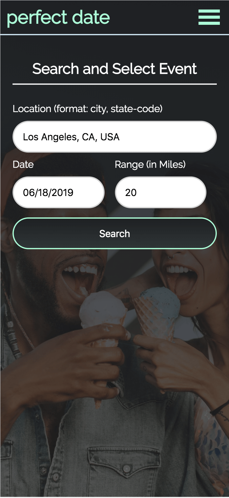
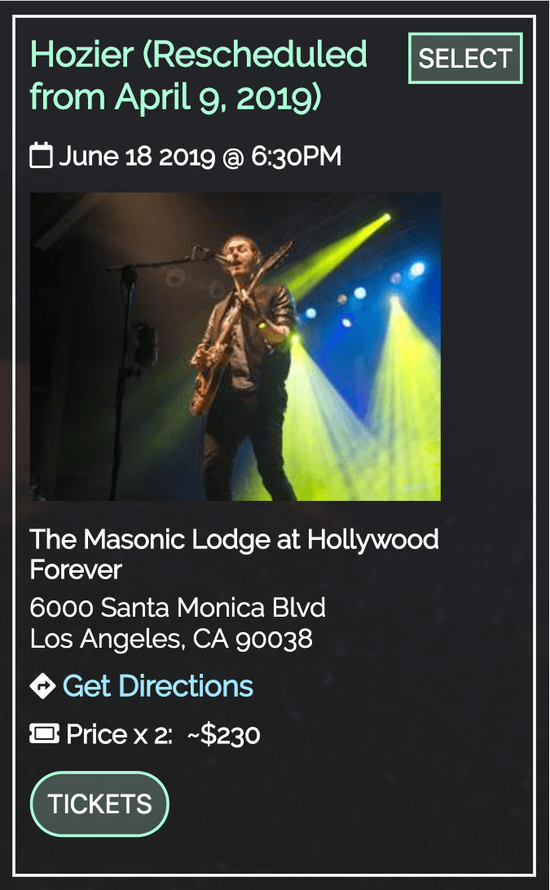
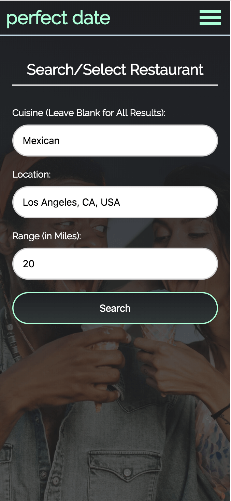
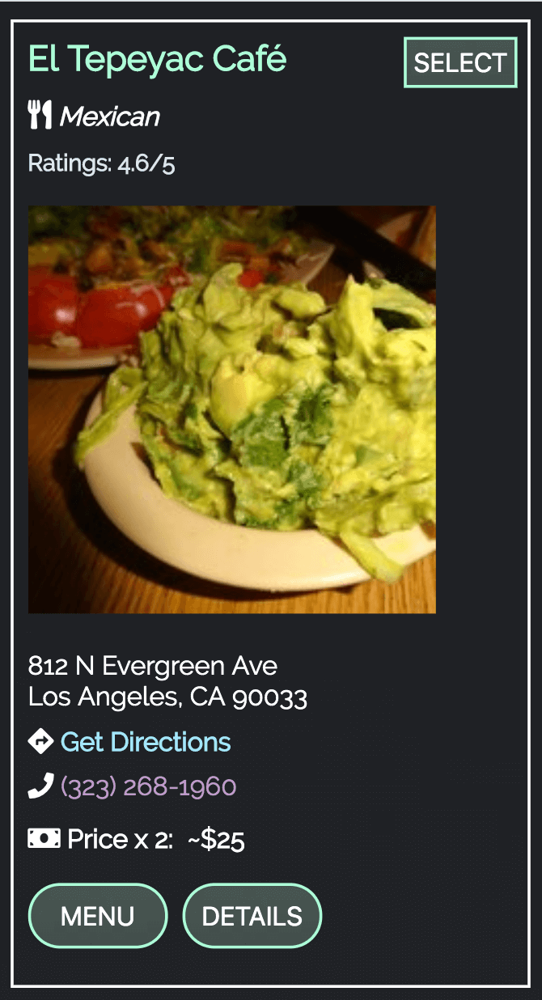
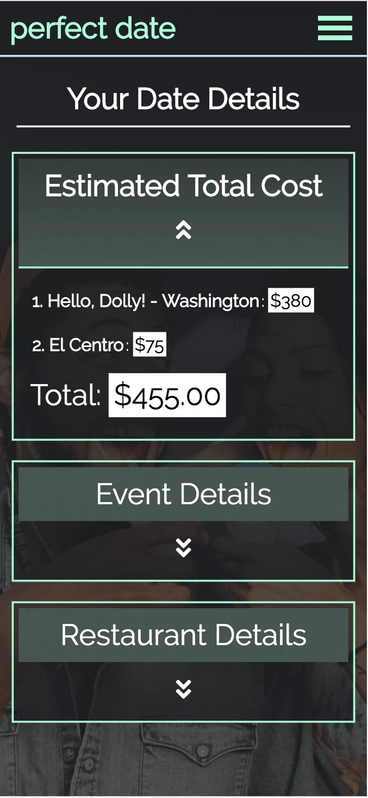
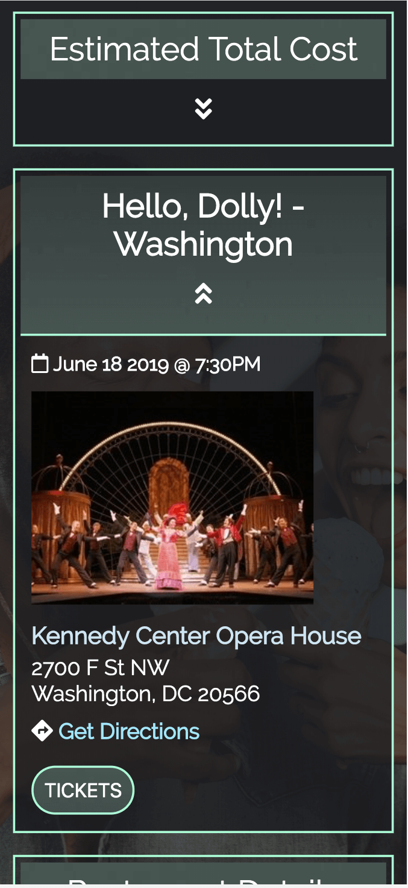
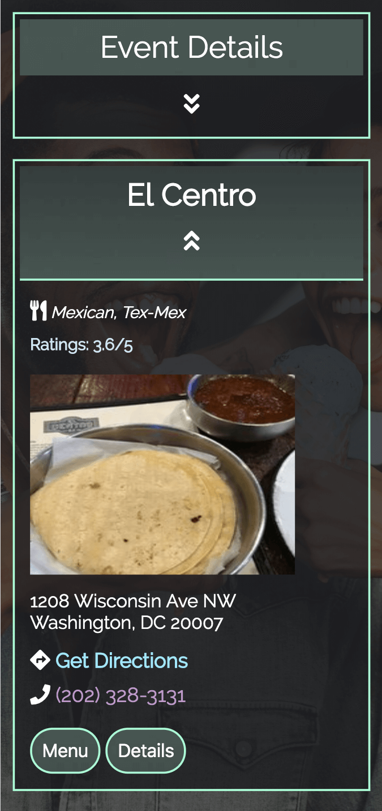

# Perfect Date App 

### Demo: https://iamcharliekim.github.io/perfect-date-app/

The Perfect Date App allows you to plan, and keep track of all the logistics and details that go into the perfect date by utilizing multiple APIs (Seat Geek API, Google GeoCode API, Zomato API) to help users search and find local entertainment and restaurants within walking distance.

  - Users can search local events based on location, range, and date
  - Users can search local restaurants based on location, cuisine-type, and range 
  - Once the user has selected an event and a restaurant for the date, Perfect Date will generate a summary of details including total estimated cost, directions, times/dates, and all other relevant information 

# Screenshots

#### Landing Page:

#### Event Search:

#### Event Search Result Cards:

#### Restaurant Search:

#### Restaurant Search Result Cards:

#### Summary Page:

# How To Use

1. Click the 'Start Planning' button on the landing page
2. Enter your location, the date you'd like to search for, and also the range in miles from your location you'd like to search.  Perfect Date will geolocate your location and automatically enter it into the Location input-field.
3. Click Search and Perfect Date will generate your results below the search form.  
4. Each result card has the date of the event, the venue, address, directions, price for 2 people, and the option to purchase tickets via SeatGeek 
5. Click "SELECT" to select the event you'd like to attend.  You will be moved to the Restaurant Search page
6. Perfect Date will automatically fill in the location input-field with the location of your selected event.  You can specify what type of cuisine you'd like to eat, and also the range in miles again.  
7. Click Search and your restaurant results will be generated below the search form.
8. Each result card has the type of cuisine, user ratings, address and directions, telephone number, price for 2, menu and more details button.  
9. Click "SELECT" again to select the restaurant you'd like to dine at.  You will be moved to the final summary page.
10. Click the "arrow-down" button for each tab to unfold all releveant details!
11. Click "+ New Date" to start over and plan a new date

### Tech
* JQuery
* Javascript
* HTML
* CSS

